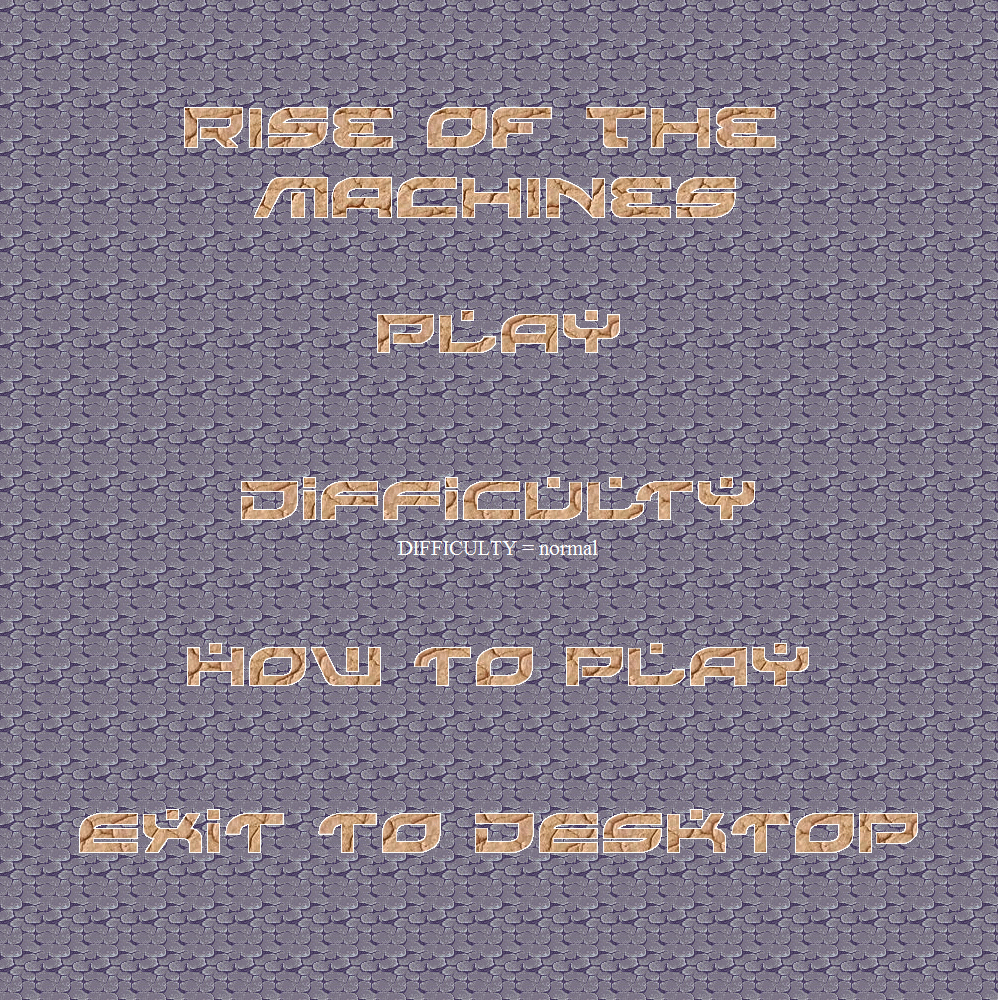
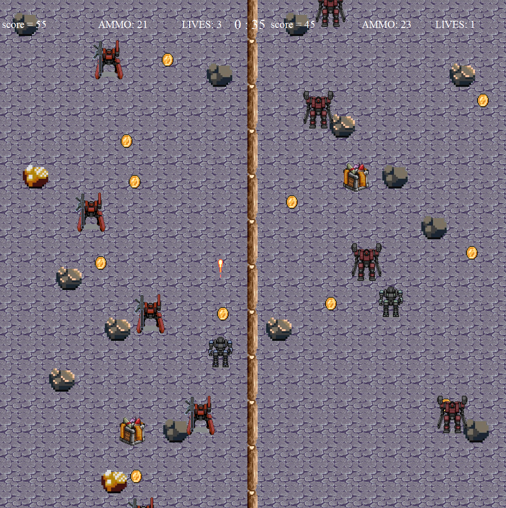

# Rise-of-the-Machines
Rise of the Machines is inspired by the 90s old retro arcade games where local multiplayer and split screen was still popular among video game industry. The game is a two-player player vs. player game. The objective of the game is to achieve a higher score than the other player in 1 minute. There are enemies, coins, ammo crates and rocks scattered throughout the map.

Once you start a game, each player gets half of a screen, divided by a wooden log in the middle. you cannot shoot across or physically cross the log, but the player can be pushed to the other side of the screen temporality only if the player touches a rock that is close to the border. You have the freedom to move around in your own side of the screen and you also have the ability to shoot 4 directions (up,left ,down, right). The current game information will be displayed on the top of the screen. That includes the current score of each player, the amount of ammos each player has, current lives of each player, and a timer that starts at 1 minute and counts down to zero. 

## Requirements
* Python 3
* Tkinter

## Instructions
Simply open "Rise of the Machines.py" in python and hit run.

## Controls
The controls of the game are very simple. Each player has 5 buttons to control the character. Player A uses “w” for moving forward, “a” for moving left, “s” for moving down, “d” for moving right, and “f” to fire your weapon. Player B uses the arrow keys for player movements, and uses slash key “/” to fire the weapon. 

## Rules
There are enemy machines scattered throughout the map. Every time you kill an enemy with your weapon will give you 10 points, and each contact with the enemy will cost you 1 life. The player model will also flash to indicate that you have touched the enemy. Besides enemies, there are collective items such as coins and ammo crate in the game. Each coin will give you 5 points and each ammo crate will give you 5 additional ammos. If you think that’s not enough challenge, there are also rocks in the game, rocks are acting as obstacles to your bullets (your bullets will not shoot through them) and to the player movement itself (the rock will push you to the side if you touch them).

## Screenshots

## Built With
* Python

## Author(s)
* Kevin Huang
